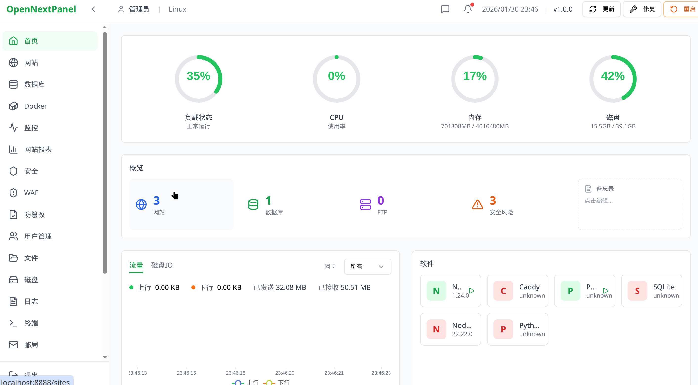

# OpenNextPanel

**开源服务器管理面板** - 简洁、安全、高效的 Linux 服务器管理解决方案

[](LICENSE)
[](https://github.com/opentocoder/opennextpanel)

## 功能特性

### 网站管理
- 多站点管理，支持 PHP/静态/反向代理
- Nginx 配置可视化编辑
- Let's Encrypt SSL 证书一键申请和自动续期
- 域名绑定和 301 重定向

### 数据库管理
- MySQL/MariaDB 数据库管理
- 数据库用户和权限管理
- phpMyAdmin/Adminer 集成
- 数据库备份与恢复

### 软件中心
- 一键安装 Nginx、PHP、MySQL、Redis 等
- 多 PHP 版本共存（5.6/7.4/8.1/8.2/8.3）
- 软件启动/停止/重启管理
- 自定义编译安装支持

### 文件管理
- Web 文件管理器
- 在线编辑、上传、下载
- 文件压缩/解压
- 权限管理

### 安全防护
- Fail2ban 暴力破解防护
- WAF 防火墙规则
- 文件防篡改监控
- 安全入口保护

### 系统监控
- CPU/内存/磁盘实时监控
- 网络流量统计
- 进程管理
- 系统日志查看

### 其他功能
- Docker 容器管理
- 定时任务管理
- FTP 用户管理
- 邮件服务管理
- Web 终端

## 技术栈

- **前端**: Next.js 16 + React + TypeScript + Tailwind CSS
- **后端**: Next.js API Routes + Node.js
- **数据库**: SQLite (面板数据) + MySQL/MariaDB (用户数据)
- **Web 服务器**: Nginx

## 系统要求

- **操作系统**: Ubuntu 22.04/24.04 LTS, Debian 11/12
- **内存**: 最低 1GB，推荐 2GB+
- **存储**: 最低 20GB
- **架构**: x86_64

## 快速安装

```bash
# 一键安装
curl -sSL https://raw.githubusercontent.com/opentocoder/opennextpanel/master/scripts/install.sh | bash

# 或手动安装
git clone https://github.com/opentocoder/opennextpanel.git
cd opennextpanel
bash scripts/install_panel.sh
```

安装完成后，访问 `http://服务器IP:8888` 进入面板。

## 默认端口

| 服务 | 端口 |
|------|------|
| 面板 | 8888 |
| phpMyAdmin | 8082 |
| Adminer | 8083 |

## 配置文件

```
/opt/opennextpanel/
├── .env              # 环境配置
├── data/
│   └── panel.db      # SQLite 数据库
├── src/              # 源代码
└── scripts/          # 安装脚本
```

## 开发

```bash
# 安装依赖
npm install

# 开发模式
npm run dev

# 构建
npm run build

# 启动
npm start
```

## 文档

详细文档请查看 [docs](docs/) 目录：

- [功能说明](docs/features.md) - 各功能模块详细介绍
- [API 文档](docs/api.md) - REST API 接口说明
- [常见问题](docs/faq.md) - FAQ

## 截图



## 贡献

欢迎提交 Issue 和 Pull Request！

1. Fork 本仓库
2. 创建功能分支 (`git checkout -b feature/AmazingFeature`)
3. 提交更改 (`git commit -m 'Add some AmazingFeature'`)
4. 推送到分支 (`git push origin feature/AmazingFeature`)
5. 创建 Pull Request

## 许可证

本项目采用 MIT 许可证 - 查看 [LICENSE](LICENSE) 文件了解详情。

## 致谢

感谢所有贡献者和开源社区的支持！

---

**OpenNextPanel** - 让服务器管理更简单
